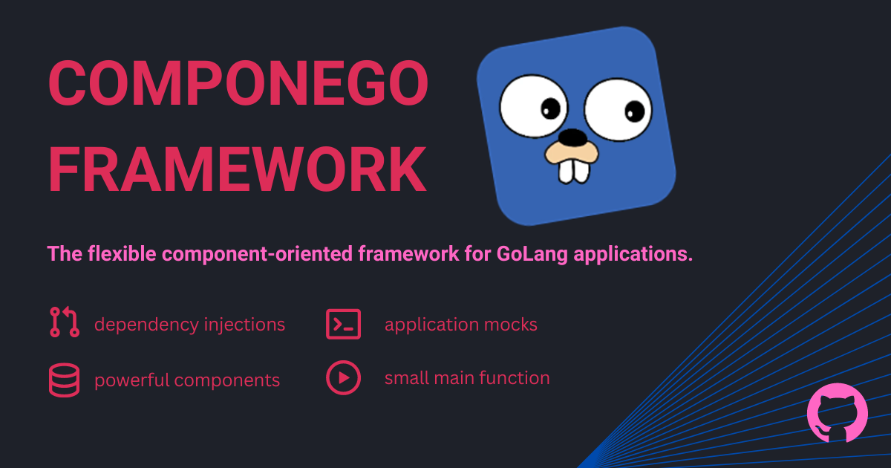

# ComponeGo Framework

[](https://goreportcard.com/report/github.com/componego/componego)
[](https://github.com/componego/componego/actions/workflows/tests.yml)
[](https://codecov.io/gh/componego/componego)
[](https://pkg.go.dev/github.com/componego/componego)
[](https://github.com/avelino/awesome-go)



It is a framework for building applications based on components. These components can be used in multiple applications and are interchangeable.
This framework is used solely to initialize the application and does NOT affect the main loop of your application.
You can still use your favorite frameworks and libraries. We allow you to wrap them in components.

Components may depend on other components. They can be expanded or reduced based on your requirements.
Components are not microservices; they are folders that contain different functionalities.

The framework has very low coupling within its code. All entities are optional.

We provide the ability to use dependency injection, configuration, and error handling.
However, one of the framework's main features is that you can modify entities without changing the application code.
This allows you to create mocks for any part of your application without changing the code.

If your application is divided into components (modules), it further separates your code into different services and allows you to reuse it in other applications.
Of course, you don’t need to make components too small.

### Documentation

Introduction: [medium.com/@konstanchuk/25bfd16a97a9](https://medium.com/@konstanchuk/25bfd16a97a9).

Visit our website to learn more: [componego.github.io](https://componego.github.io/).

The documentation is up-to-date with the latest version of the framework.
Please update your version to [the latest](https://github.com/componego/componego/releases).

### Examples

You can find some examples [here](./examples).

A typical application of this framework looks like [this](./examples/url-shortener-app/internal/application/application.go).

### Skeleton

You can quickly create a basic application in several ways:
```shell
curl -sSL https://raw.githubusercontent.com/componego/componego/master/tools/create-basic-app.sh | sh
```
or
```shell
wget -O - https://raw.githubusercontent.com/componego/componego/master/tools/create-basic-app.sh | sh
```
On Windows, you can run the commands above with Git Bash, which comes with [Git for Windows](https://git-scm.com/download/win).

### Contributing

We are open to improvements and suggestions. Pull requests are welcome.

### License

The source code of the repository is licensed under the [Apache 2.0 license](./LICENSE).
The core of the framework does not depend on other packages.
