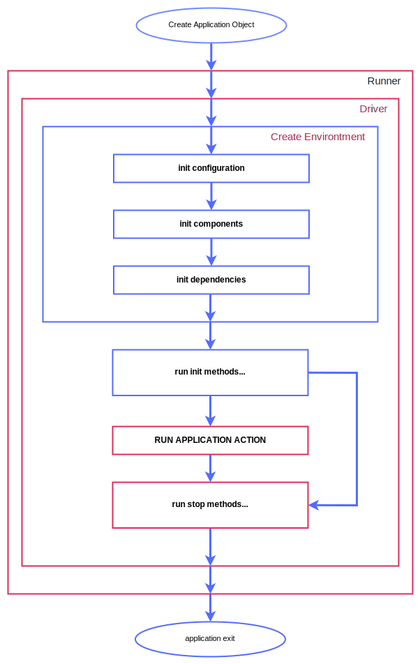

# Application Driver

## Basic information

The application driver plays a pivotal role in the Componego runtime by serving as the entry point that initializes
and orchestrates all essential functions within an application.
Essentially, it acts as the engine that kick-starts the execution of an application by coordinating various components,
managing configurations, and initiating critical processes.
This driver ensures a smooth and controlled start for the application, setting the stage for seamless operation.

## Differences between Runner

The difference is minimal, but the driver can be common for many applications,
and it initiates the basic functions of the application by the options (configuration) of the driver.
Driver options are what control application (environment factory, dependency manager, event manager,
configuration manager, input reader, output writer, error output writer).
And yes, you can change them, because they are all just [options](./runner.md#specific-driver-options).

In most cases you don't need to know about driver options, but if you want to change some part of the core of the framework,
then open the [source code](https://github.com/componego/componego/tree/master/impl/driver){:target="_blank"} to see how it is implemented.

## Application initialization order

<figure markdown>
  { width="622" height="1202" loading=lazy }
  <figcaption>Componego Flow</figcaption>
</figure>

!!! note
    Red elements on image can handle errors that occurred in previous (or nested) functions.

!!! note
    We recommend looking at this diagram again when you fully understand
    how to create [application](./application.md) and [components](./application.md), and the entities they provide.

The general order of calling functions is as follows:

1. runner.Run
2. driver.RunApplication
3. application.ApplicationConfigInit
4. application.ApplicationComponents
5. component.ComponentComponents (+ getting components for each component)
6. component.ComponentDependencies (for each of the active components)
7. application.ApplicationDependencies
8. component.ComponentInit (for each of the active components)
9. application.ApplicationAction
10. component.ComponentStop (for each of the active components in reverse order)
11. application.ApplicationErrorHandler (If there was an error)
12. exit

Of course, not all methods that are called are described here (if the [application](./application.md) or [component](./component.md) has these methods).
But this list is enough to have a brief overview of the application initialization order.

!!! note
    The order of initialization and method calls is important in rewriting application elements.
    For example, an [application](./application.md)  can rewrite [dependencies](./dependency.md) of [component](./component.md)
    because a method that returns dependencies for an application object (^^ApplicationDependencies^^) is called
    after the same function for components (^^ComponentDependencies^^).

    We talk about rewriting elements further on the pages. This can be useful when creating [mocks](../tests/mock.md).
