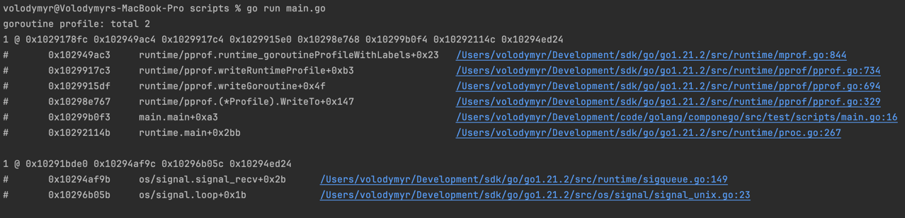

# Goroutine leak when exiting the application

Only in development mode, you may see warnings when exiting the application that some goroutines are still running.

This means that in addition to the main goroutine, other goroutines are also running.
In any case, all goroutines will be terminated after exiting the application.
However, some goroutines may be doing important work that will be terminated forcefully and possibly unsuccessfully.

Of course, you cannot guarantee 100% that all goroutines will be completed, but you should strive for this.

Some packages run goroutines that constantly monitor events.

Here is an example code and how you can detect a goroutine leak.
    ```go
    package main

    import (
        "os"
        "os/signal"
        "runtime/pprof"
        "syscall"
    )

    func main() {
        interruptChan := make(chan os.Signal, 1)
        signal.Notify(interruptChan, os.Interrupt, syscall.SIGTERM)
        // ...
        signal.Stop(interruptChan)
        // ...
        _ = pprof.Lookup("goroutine").WriteTo(os.Stdout, 1)
    }
    ```
The output of this program will be approximately the following:



As you can see, we still have a goroutine that monitors signals.
This goroutine is safe, but there may be other goroutines.

Please ignore this warning if there are no unwanted goroutine leak.
